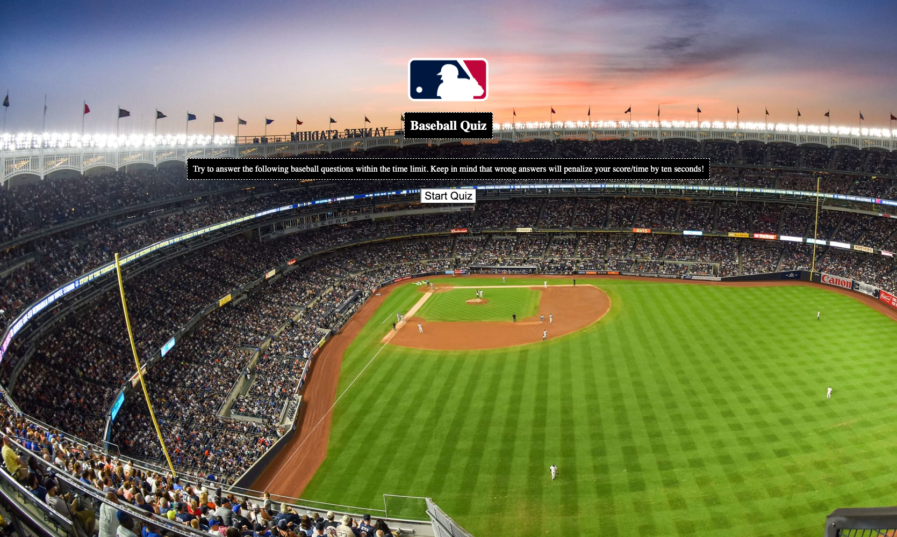

# Code-Quiz

## Description

This is a baseball quiz application. The user is given 100 seconds to answer 10 questions. The quiz and timer start when the user clicks the start button. Each time a question is answered incorrectly 10 seconds is subtracted from the timer. At the end of the quiz, the user can enter their initials to add their highscore to the list.

## Screenshot

## Link to application

This site was built using [GitHub Pages](https://ryan-m-taylor.github.io/Code-Quiz/)